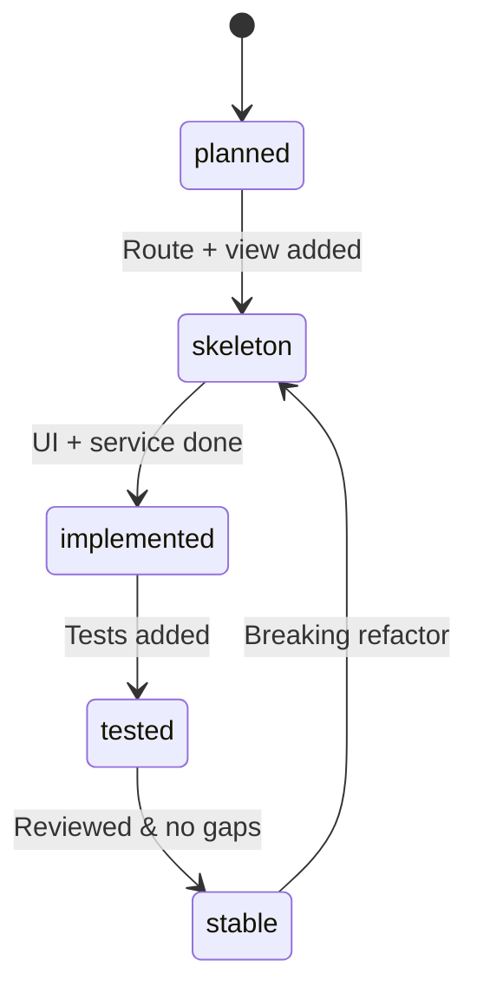

# Documentation Versioning Conventions

## Doc version format

Semantic versioning for the **documentation set**, independent of the npm package version:

```
MAJOR.MINOR.PATCH
```

| Bump | When |
|------|------|
| MAJOR | Breaking route change, auth flow change, API contract change |
| MINOR | New feature folder, new route section, new architecture doc |
| PATCH | Progress updates, typo fixes, diagram tweaks, test status changes |

Current doc version is declared in [README.md](../README.md).

## Screen / capability lifecycle

```
planned → skeleton → implemented → tested → stable
```



## Deprecation

When a route or feature is removed or replaced:

1. Set status to `deprecated` in progress table (do not delete the row).
2. Add deprecation date and replacement in **Notes**.
3. Bump doc MINOR or MAJOR depending on impact.
4. Log in [CHANGELOG.md](../CHANGELOG.md).

## Cross-references

Each feature progress file should include:

```markdown
**Feature version:** 1.0.0
**Last reviewed:** YYYY-MM-DD
**Source:** `src/features/<feature>/`
```

## Git workflow for agents

1. Make code changes in feature branch.
2. Update matching `features/<feature>/progress.md` in the same commit/PR when possible.
3. Append CHANGELOG entry if doc version bumps.
4. Never commit secrets or `.env` values into docs.
